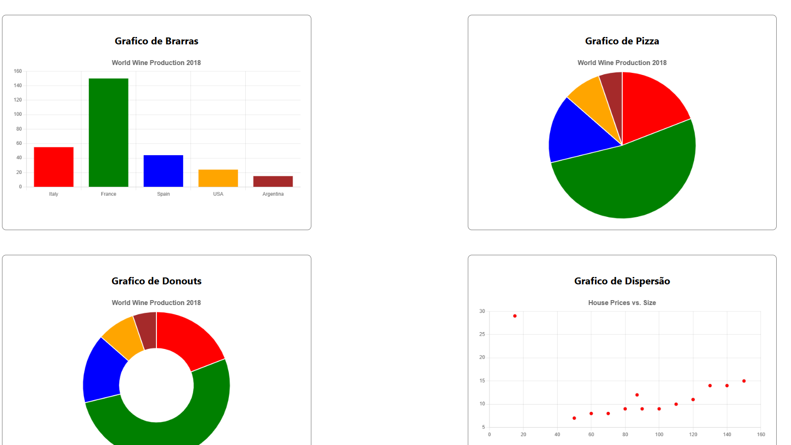
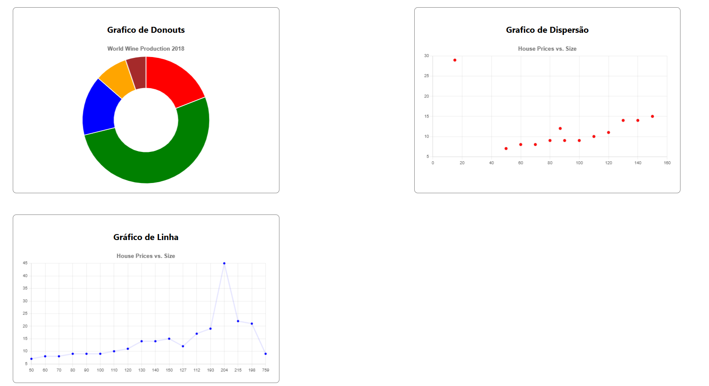

# INTRO

This JavaScript code snippet is a simplified way to use the Chart class, which is employed to build charts. 
It wraps the Chart class inside the createChart function, which takes three parameters: the first is the ID
of the canvas element where the chart will be rendered; the second is the chart type — such as line, doughnut, 
pie, or bar; and the third is the API URL that will provide the data.


## 1 fetchChartData

The fetchChartData(url) function receives the API URL that provides the data to be plotted in the chart.
Inside it, the fetch function is used to make the request. If successful, the response returns the x and
y axis data according to the chart type specified in the second argument. Next, the data formats accepted
by each chart type will be presented.

### 1.1 Line Chart
```
{
    "xValues": [50,60,70,80,90,100,110,120,130,140,150, 127, 112, 193, 204, 215, 198, 759],
    "yValues": [7,8,8,9,9,9,10,11,14,14,15, 12, 17, 19, 45, 22, 21, 9]
}
``` 

### 1.2 Bar Chart / Pie Chart / Doughnut Chart
```
{
    "xValues": ["Italy", "France", "Spain", "USA", "Argentina"],
    "yValues": [55, 150, 44, 24, 15],
    "barColors": ["red", "green", "blue", "orange", "brown"]
}
``` 


### 1.3 Plot Chart
```
{
[
    {
        "x": 50,
        "y": 7
    },
    {
        "x": 60,
        "y": 8
    },
    {
        "x": 70,
        "y": 8
    },
    {
        "x": 80,
        "y": 9
    },
    {
        "x": 90,
        "y": 9
    },
    {
        "x": 100,
        "y": 9
    },
    {
        "x": 110,
        "y": 10
    },
    {
        "x": 120,
        "y": 11
    },
    {
        "x": 130,
        "y": 14
    },
    {
        "x": 140,
        "y": 14
    },
    {
        "x": 150,
        "y": 15
    },
        {
        "x": 87,
        "y": 12
    },
        {
        "x": 15,
        "y": 29
    }
]
}
``` 

## 2 createChart
The createChart function, as mentioned earlier, receives the previously described arguments: the ID of the chart’s canvas element, the chart type, and the API URL. It then calls the fetchChartData() function to retrieve the data and gets the canvas context, which acts like the “sheet of paper” on which the chart will be drawn.

The chart type is checked through different conditions, allowing the creation of bar, pie, doughnut, and line charts. If you wish to add more chart types, you can easily do so by following the same structure.

Finally, the function instantiates Chart(ctx, config), passing the context and configuration with the data returned from the API, which renders the chart on the screen.

## 3 Example

### 3.1 index.html
```
<!DOCTYPE html>
<html lang="en">

<head>
    <meta charset="UTF-8">
    <meta name="viewport" content="width=device-width, initial-scale=1.0">
    <title>Graficos</title>
    <script src="https://cdn.jsdelivr.net/npm/chart.js"></script>
    <script type="module" src="/java_script/chart/static/chart_.js"></script>
</head>

<body style="font-family: 'Segoe UI', Tahoma, Geneva, Verdana, sans-serif;">
    <section style="display: grid; grid-template-columns: repeat(2, 1fr);">

        <div
            style="margin: 30px; max-width: 700px; max-height: 500px; border: 1px solid gray; border-radius: 10px; padding: 25px;">
            <h2 style="text-align: center;">Grafico de Brarras</h2>
            <canvas id="chart-bars" style="max-height: 400px;"></canvas>
        </div>

        <div
            style="margin: 30px; max-width: 700px; max-height: 500px; border: 1px solid gray; border-radius: 10px; padding: 25px;">
            <h2 style="text-align: center;">Grafico de Pizza</h2>
            <canvas style="max-height: 400px;" id="chart-pie"></canvas>
        </div>

        <div
            style="margin: 30px; max-width: 700px; max-height: 500px; border: 1px solid gray; border-radius: 10px; padding: 25px;">
            <h2 style="text-align: center;">Grafico de Donouts</h2>
            <canvas style="max-height: 400px;" id="chart-donouts"></canvas>
        </div>

        <div
            style="margin: 30px; max-width: 700px; max-height: 500px; border: 1px solid gray; border-radius: 10px; padding: 25px;">
            <h2 style="text-align: center;">Grafico de Dispersão</h2>
            <canvas style="max-height: 400px;" id="scatter-plots"></canvas>
        </div>

        <div
            style="margin: 30px; max-width: 700px; max-height: 500px; border: 1px solid gray; border-radius: 10px; padding: 25px;">
            <h2 style="text-align: center;">Gráfico de Linha</h2>
            <canvas style="max-height: 400px;" id="chart-line"></canvas>
        </div>

    </section>
</body>

</html>

```

### 3.2 chart_.js
```

document.addEventListener('DOMContentLoaded', async () => {
    await createChart('chart-bars', 'bar', 'static/data.json'),
    await createChart('chart-pie', 'pie', 'static/data.json'),
    await createChart('chart-donouts', 'doughnut', 'static/data.json'),
    await createChart('scatter-plots', 'scatter', 'static/data_plot.json'),
    await createChart('chart-line', 'line', 'static/data_line.json')
})

```







